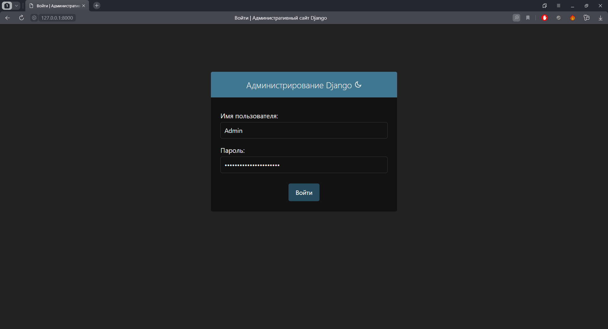
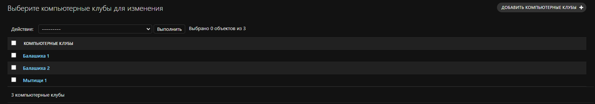
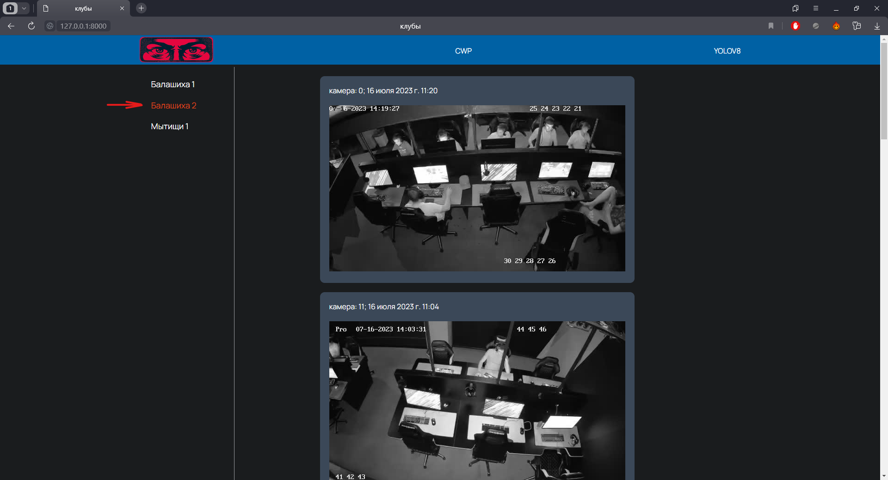

# Analyze the state of the user's workplace YOLO 8 Project For ITMO JUNIOR ML Contest
## Описание
Проект "Analyze the state of the user's workplace" для ITMO JUNIOR ML Contest представляет собой веб-приложение, разработанное для компьютерного клуба, которое подключено к системе видеонаблюдения. Главная цель приложения - обработка информации, полученной от камер, при помощи нейронной сети и отображение мест, которые не были убраны в течение 10 минут.

## Установка
1. Скопируйте репозиторий:
   [https://github.com/DanilMargaryan/cleanworkplace.git](https://github.com/DanilMargaryan/cleanworkplace.git)
2. Установите зависимости, указанные в файле `requirements.txt`:
```python
pip install -r requirements.txt
```
3. Запустите веб-приложение:
командой: `python manage.py runserver`

## Использование
1. Вход в систему:
    1.1 Администратор должен войти в систему, используя свои учетные данные.
    
2. Добавление новых клубов и камер:
    2.1 В административной панели сайта доступна функция добавления новых клубов и соответствующих им камер.
    
    2.2 Администратор должен добавить новые клубы и указать информацию о камерах, установленных в этих клубах.
3. Выбор адреса клуба:
    3.1 На левой панели сайта, в меню, администратор должен выбрать адрес клуба, для которого он хочет отслеживать неубранные места.
    
    3.2 При выборе адреса клуба система будет начинать отслеживание и анализ изображений с камер, связанных с этим клубом.
4. Оповещения о неубранных местах:
    4.1 Если система обнаруживает неубранное место на изображении с камеры, связанной с выбранным клубом, она автоматически отправляет оповещение на сайт.
    4.2 Оповещение содержит фотографию неубранного места и информацию о камере, с которой был сделан снимок.